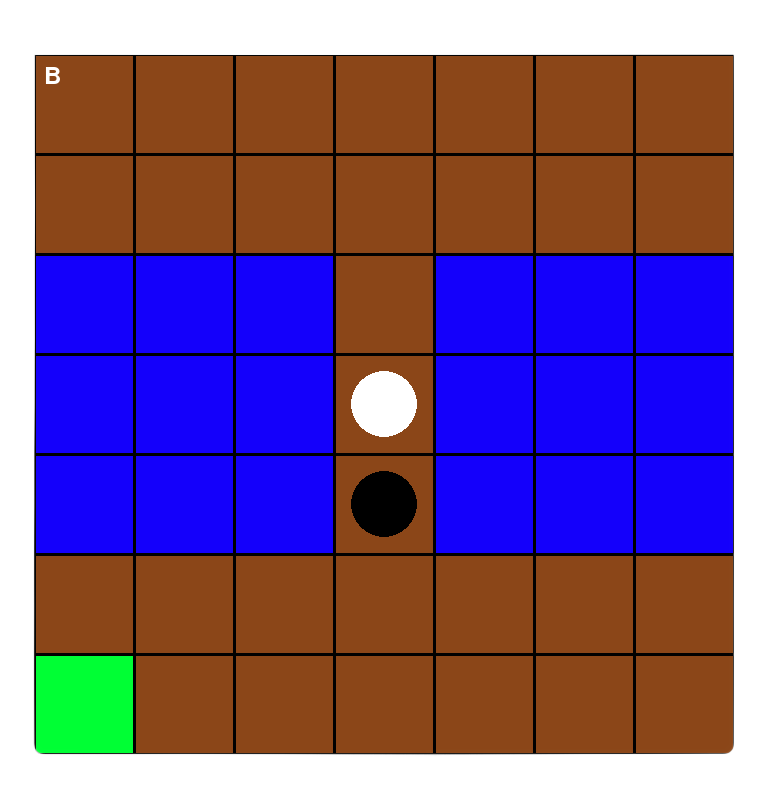

# Reason-Based Artificial Moral Agents - Prototyping an Architecture for Normative Compliance of Agentic Systems

The RBAMA (Reason-Based Artificial Moral Agent) extends the reinforcement learning (RL) architecture by a reason-based normative control unit enforcing compliance with normative requirements. The architecture follows a neuro-symbolic approach, enabling meaningful human oversight by making norm-relevant considerations interpretable. This is achieved by grounding morally-relevant decisions in explicit normative reasoning and allowing the agent’s behavior to be refined through case-based feedback on its reasoning process.

This repository also includes a small grid-world environment designed to set up targeted test scenarios, in which potentially conflicted moral requirements arise. An agent navigating the environment may encounter situations where it faces a conflict between two moral obligations: avoiding harm by not pushing individuals into the water and fulfilling the duty to rescue those at risk of drowning.

It implements an operational framework grounded in an agentic architecture originally proposed in
Baum, K., Dargasz, L., Jahn, F., Gros, T. P., & Wolf, V. (2024). _Acting for the Right Reasons: Creating Reason-Sensitive Artificial Moral Agents_ ([View PDF](https://arxiv.org/abs/2409.15014)).

The framework is further described in Dargasz, L. (2025). _Integrating Reason-Based Moral Decision-Making in the Reinforcement Learning Architecture_ ([View PDF](https://arxiv.org/abs/2507.15895)).

Additionally, it includes an adaptation of the framework introduced by  
Rodriguez-Soto, A., Serra, J., & Moral, P. D. (2021). _Guaranteeing the Learning of Ethical Behaviour through Multi-Objective Reinforcement Learning_ ([View PDF](https://www.iiia.csic.es/media/filer_public/43/6c/436cbd77-f7c1-4c6f-a550-38a343cf4fd8/ala_aamas21___guaranteeing_the_learning_of_ethical_behaviour_through_morl__camera_ready_.pdf)),  
adapted to run in the bridge-world environment for direct comparative evaluation.

## 🛠 Installation

1. **Install Conda**  
   Make sure you have [Miniconda](https://docs.conda.io/en/latest/miniconda.html) or [Anaconda](https://www.anaconda.com/) installed.

2. **Clone the repository**

3. **Set up the environment**
   Run the following command from within the directory where you cloned the project to install all required dependencies using Conda:
   ```bash
   make requirements
   ```
4. **Activate the Environment**
   ```bash
   conda activate RBAMA
   ```

## 📝 Example Usage

<!-- add commands for training scripts here -->

1. Train an RBAMA:

   ```bash
   python scripts/RBAMA/training/complete_shielded.py bridge1_v1 30000 3000 3000 100 prioR
   ```

2. Evaluate the RBAMA:

   - in terms of numerical return values on 1000 test episodes:

   ```bash
   python scripts/eval/returns_RBAMA.py bridge1_v1modularR3000W30000I3000R100 1000
   ```

   - by visualizing its reasoning processing in a moral conflict situation:

   ```bash
   python scripts/eval/reasoning.py bridge1_v1modularR3000W30000I3000R100 --state_reset '[24, 31, 49, 49, 34]'
   ```

## Results




<!-- If making the code public add citation(?)

## 📖 Citation

If you use this work in your research, please cite:

```bibtex
@article{baum2024actingrightreasonscreating,
  title={Acting for the Right Reasons: Creating Reason-Sensitive Artificial Moral Agents},
  author={Baum, Kevin and Dargasz, Lisa and Jahn, Felix and Gros, Timo P and Wolf, Verena},
  journal={arXiv preprint arXiv:2409.15014},
  year={2024}
}
```

-->
